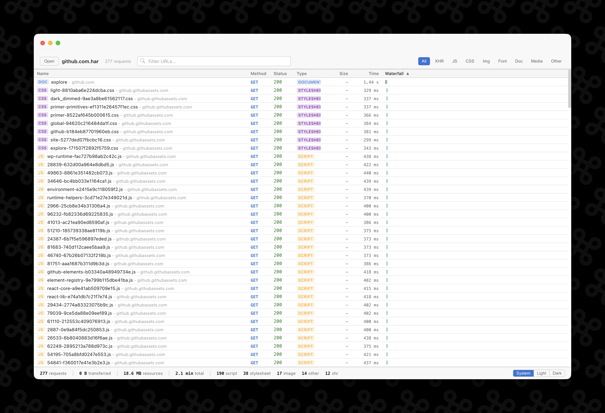
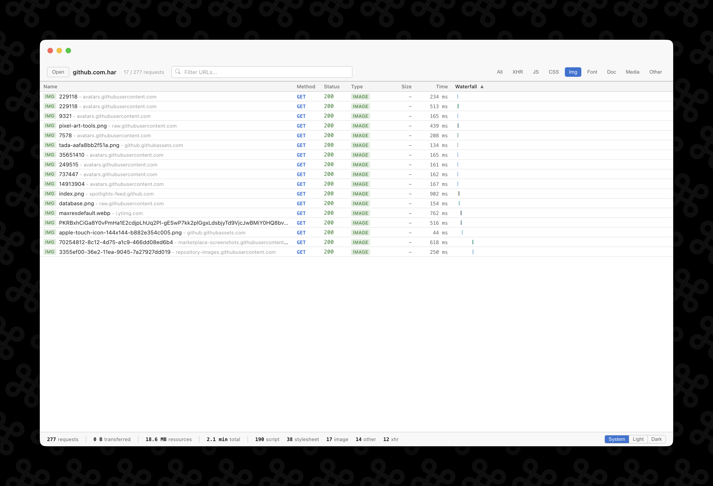
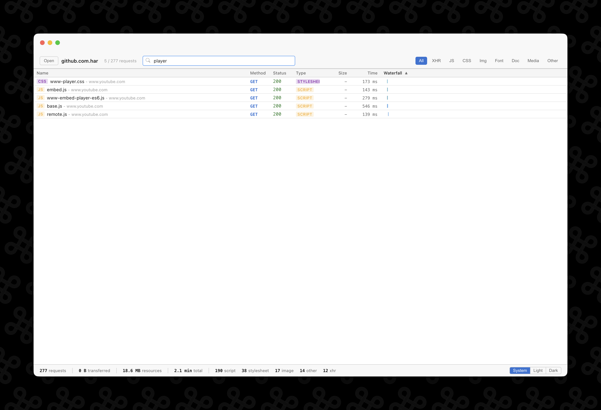
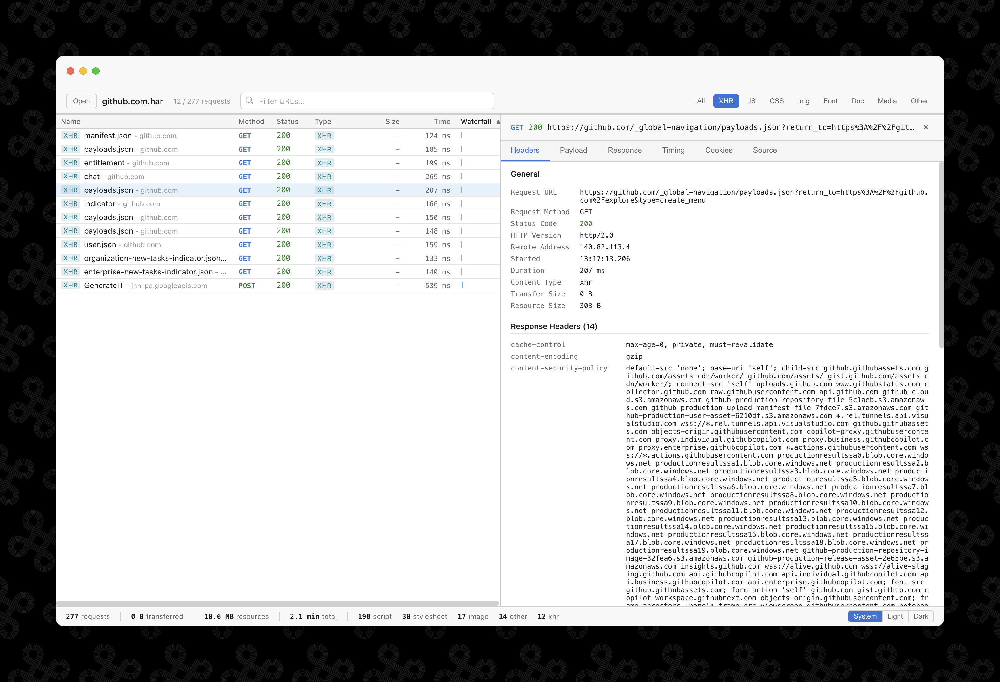
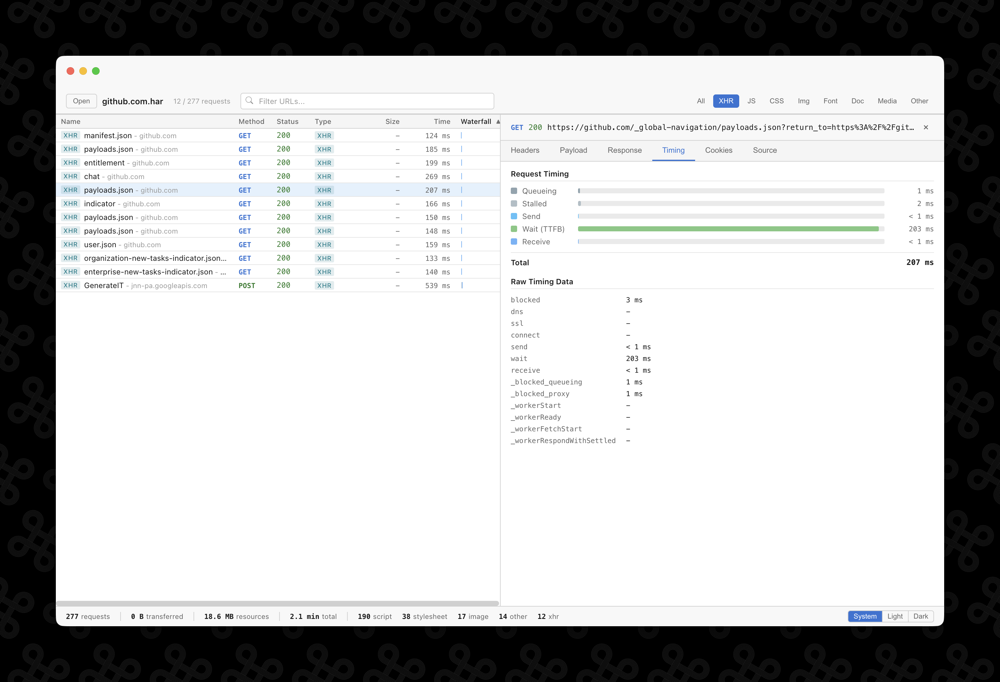
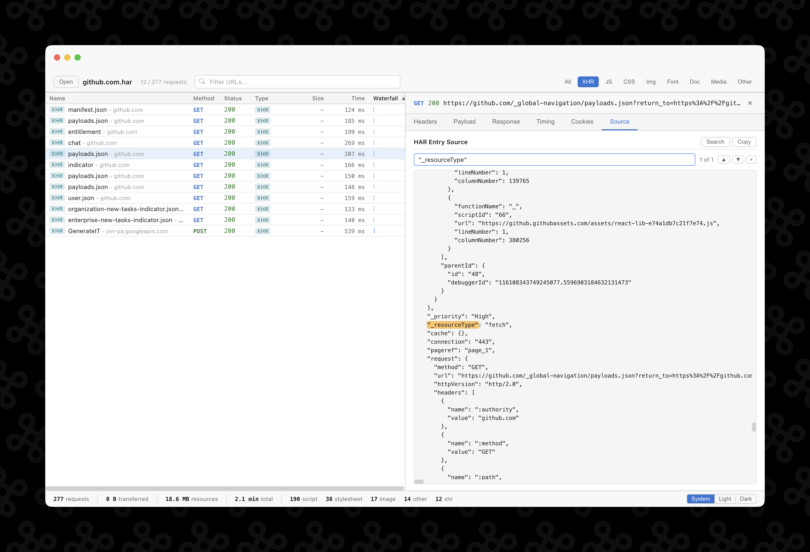
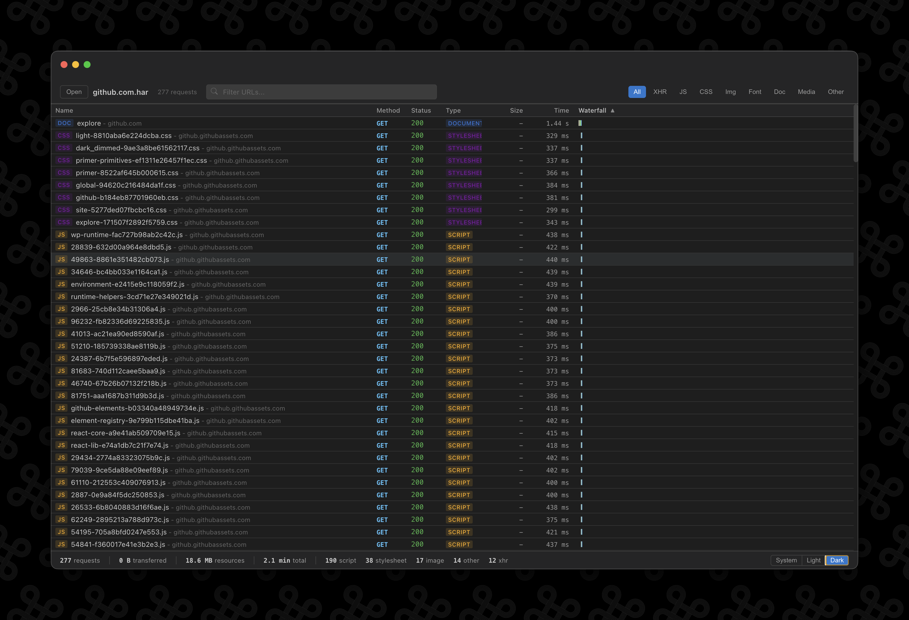

<p align="center">
  
</p>

# Netscope

A desktop application for viewing and analyzing HTTP Archive (HAR) files. Available for macOS, Windows, and Linux. Built with Electron, React, and TypeScript.

**[netscopeapp.com](https://netscopeapp.com)**

Netscope gives you the same network inspection experience as Chrome DevTools, but as a standalone app -- open HAR files, filter and sort requests, inspect headers and timing, and search through raw source data. HAR files often contain sensitive session data like cookies and auth tokens, so everything stays local on your machine.



## Features

### Request list with sorting and waterfall

Every request is displayed in a sortable table with method, status, content type, transfer size, duration, and a color-coded waterfall chart. Click any column header to sort.

### Filter by content type or search by URL

Use the content type tabs (XHR, JS, CSS, Img, Font, Doc, Media, Other) to narrow down the list, or type in the search bar to filter by URL.

| Filter by type                                            | Search by URL                                            |
| --------------------------------------------------------- | -------------------------------------------------------- |
|  |  |

### Detailed request inspection

Click any request to open the detail panel. The Headers tab shows general info, request headers, and response headers. Other tabs show payload, response body, cookies, and timing data.



### Timing breakdown

The Timing tab visualizes the request lifecycle -- queueing, stalled, send, wait (TTFB), and receive -- with a horizontal bar chart and raw timing data.



### Source search

The Source tab shows the raw HAR JSON for any entry. Open the search bar with Cmd+F / Ctrl+F, type a query, and matching text is highlighted inline. Navigate between matches with Enter, Shift+Enter, or Cmd+G / Ctrl+G.



### Dark mode

Switch between System, Light, and Dark themes using the toggle in the bottom-right corner. Your preference is saved across sessions.



### Other features

- **Three ways to open files** -- Use File > Open (Cmd+O / Ctrl+O), drag-and-drop onto the window, or double-click `.har` files in your file manager
- **Multi-window support** -- Each HAR file opens in its own window; re-opening an already-open file focuses the existing window
- **Disk cache detection** -- Responses served from the browser cache are labeled "(from disk cache)" on the status code
- **Summary bar** -- Aggregate stats at the bottom: total requests, transfer size, resource size, total time, and breakdown by type
- **Response preview** -- Auto-formatted JSON, rendered base64 images, and raw text display
- **Code-signed and notarized** -- macOS builds are signed with a Developer ID certificate and notarized by Apple, so Gatekeeper won't block them

## Installation

Download the latest release for your platform from [Releases](https://github.com/Dru89/netscope/releases).

### macOS

Download the `.dmg`, open it, and drag Netscope to your Applications folder. The app is code-signed and notarized, so Gatekeeper should not block it.

To set Netscope as the default handler for `.har` files:

1. Right-click any `.har` file in Finder
2. Choose **Get Info**
3. Under **Open with**, select **Netscope**
4. Click **Change All...**

### Windows

Download the `.exe` installer and run it. Windows builds are unsigned, so you may see a SmartScreen warning on first launch -- click **More info** then **Run anyway** to proceed.

### Linux

Download the `.AppImage` or `.deb` from the Releases page.

For the AppImage, make it executable and run it:

```bash
chmod +x Netscope-*.AppImage
./Netscope-*.AppImage
```

For Debian/Ubuntu, install the `.deb` directly:

```bash
sudo dpkg -i netscope_*.deb
```

## Development

Built with Electron, React, TypeScript, and Vite. See [docs/development.md](docs/development.md) for setup instructions, scripts, and the release process.

## License

MIT
